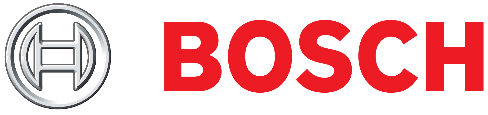

[**Call for Contesters**](call.html) | [**About**](about.html) | [**Logistics**](evaulation.html) | [**Committee**](committee.html) 

## Welcome to the Device-Free Localization Competition

We are happy to announce the Device-Free Localization (DFL) Competition at CPS-IoT Week 2019!  The competition will bring together top researchers from around the world to meet in Montréal, Québec, during CPS-IoT Week, 15-18 April 2019, and determine which group has the most accurate DFL system.  

We hope you will [join as a contestor](call.html) and test your device-free localization software and hardware system against those of the other competitors.  Joining the competition first involves registering your team by submitting a two-page abstract about your team and system.  The [organizing committee](committee.html) will select participating teams by 15 March 2019.  If selected, you and your team will attend CPS-IoT Week 2019 and set up and calibrate your system prior to evaluation day.  All systems are evaluated as described on the [Logistics](evaluation.html) page, and the two teams with the lowest tracking error in each of two categories will win the competition.  Awardees will receive generous prizes from our sponsor, [Bosch](https://www.bosch.com/).

### Sponsor
The Device-Free Localization Competition is generously sponsored by 

### Important Dates
* Registration Deadline: **March 7, 2019**
* Final Notification: March 15, 2019

