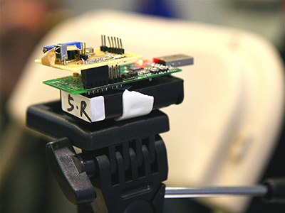

## About the Competition

We will hold the first Bosch Device-Free Localization Competition at [CPS-IoT Week 2019](http://cpslab.cs.mcgill.ca/cpsiotweek2019/).  Join us in Montreal, 15-18 April 2019 for the competition!  You can participate as a competitor, or as an observer.  We will determine winners during the competition and announce the winners during CPS-IoT Week.

IPSN is known for its [Microsoft Indoor Localization Competition](https://www.microsoft.com/en-us/research/event/microsoft-indoor-localization-competition-ipsn-2018/), in which a person's device must be located based on signals it sends or receives from the local wireless infrastructure.  In contrast, in this competition, participating teams must locate a person who is not carrying any physical or wireless device.  Instead, teams must use infrastructure to send and receive wireless signals.  By way of changing the radio wave propagation channel between the devices, the person changes the signals received.  The team must locate and track the person based on these changes.  

The IPSN conference has a history of RF localization which predates the long-lasting Localization competition. At IPSN 2007, the _IPSN Extreme Sensing_ person counting competition was held.  In this competition, competitors had to count line crossings, and the most accurate count of crossings won.

Although many teams used infrared sensors, an MIT team used RF sensors and won.  The accuracy and reliability of RF sensing at the Extreme Sensing competition was one of the inspirations for the development of RF-based device-free localization.  Thus there is no better place than at IPSN 2019 to run a DFL competition.  Further, there are many (at least 100) papers published in DFL each year, but very little community-generated data to use in comparative evaluation of DFL systems.  We hope this competition will challenge research groups to do their best to advance DFL and to help direct future research directions.  

Any industry, university, or government team may compete.  At least one member of the team must attend and have a CPSWeek registration.

Teams will enter in one of these two categories:
1. **Signal Strength Software-only**: The organizers will deploy a set of 10 sensors that collect received signal strength (RSS) only.  These devices will provide real-time RSS to any team in this category.  A team must access the RSS measurements, which will be available on the network, run their DFL software on the data, and post a position estimate (or decide that no person is in the area) at given time instants.
2. **Team-deployed Hardware**:  The team will provide and deploy their own network of RF sensors.  These might include WiFi CSI measurement devices; UWB-IR measurement devices, or some other RF measurement system.  The team will be given time to set up their hardware, and to test their system.  In this case, the team's system must post a position estimate (or again, that no person is in the area) at given time instants.

For the Team-deployed Hardware category, each participating team will discuss their spectral needs in their application, and we will assign channels beforehand when possible to avoid interference.

For the Signal Strength Software-Only teams, we will post a [public github RTI project](https://github.com/npatwari/dflcompetition).  We will [adapt the RTI code](https://github.com/npatwari/rti) to make it work for the Signal Strength Software-only category.  In that category, a team modify our software so that they have a system that works "out of the box".  Of course, our software could be improved in multiple ways, and modifications and adaptations to the algorithm and its parameters will make its performance improve.

## Video playlist:
<iframe width="700" height="394" src="https://www.youtube.com/embed/videoseries?list=PLQuDEk4rPDON5Hrf5Zp3Stx7pGibNB7kZ" frameborder="0" allow="autoplay; encrypted-media" allowfullscreen></iframe>

