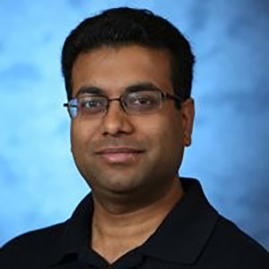
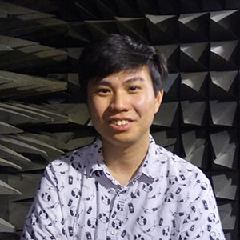
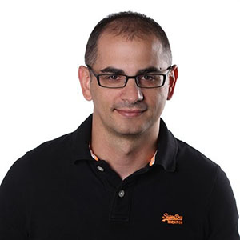
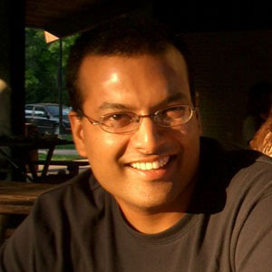
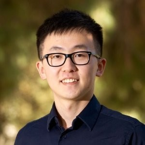

## Organizing Committee
	| 	
[Vivek Jain](https://www.linkedin.com/in/jainvk/) |
Lead Expert, Wireless Connectivity, [Bosch Research](http://www.bosch.com/research)

	| [Vivek Jain](https://www.linkedin.com/in/jainvk/), Lead Expert, Wireless Connectivity, [Bosch Research](http://www.bosch.com/research) 
	| [Anh Luong](http://www.anhnluong.com/), Postdoctoral Researcher, [Carnegie Mellon University](https://www.cmu.edu/) 
	| [Dimitrios Lymberopolous](https://www.microsoft.com/en-us/research/people/dlymper/#!publications), Principal Researcher, [Microsoft Research](https://www.microsoft.com/en-us/research/) 
 | [Neal Patwari](https://span.engineering.wustl.edu/), Professor, [Washington University in Saint Louis](https://wustl.edu/) 
 | [Elahe Soltanaghaei](http://www.cs.virginia.edu/~es3ce/), PhD Candidate, [University of Virginia](http://www.virginia.edu/) 
 	| [Yunze Zeng](https://www.linkedin.com/in/yunze-zeng-52aa23b5/), Post Doc - Wireless Research, [Bosch Research](http://www.bosch.com/research) 
 
